# Business Brain V3 - Entity Relationship Diagram

This file defines the physical and logical relationships connecting tenants, memories, causal graph nodes, diagnostic workflows, and financial forecasts.

```mermaid
erDiagram
    system_tenants ||--o{ merchant_configurations : "has configuration"
    system_tenants ||--o{ brain_working_memory : "has working cache"
    system_tenants ||--o{ brain_business_experience : "has reinforcement metrics"
    system_tenants ||--o{ brain_evolution_memory : "evolves historically"
    system_tenants ||--o{ causal_reasoning_runs : "runs reasoning workflows"
    system_tenants ||--o{ brain_forecast_telemetry : "generates forecasts"
    system_tenants ||--o{ brain_growth_strategies : "formulates growth strategies"
    system_tenants ||--o{ brain_investigation_cases : "dispatches autonomous investigations"
    system_tenants ||--o{ brain_decision_critiques : "subjects to self-critique"
    system_tenants ||--o{ executive_board_reports : "compiles executive reports"

    causal_reasoning_runs ||--|{ causal_propagation_steps : "cascades down steps"
    causal_diagram_nodes ||--o{ causal_diagram_edges : "serves as source/target"

    system_tenants {
        VARCHAR tenant_id PK
        VARCHAR store_name
        VARCHAR country_code
        VARCHAR currency
        TIMESTAMP created_at
    }

    merchant_configurations {
        VARCHAR config_id PK
        VARCHAR tenant_id FK
        INT low_stock_threshold
        NUMERIC vat_rate_default
        NUMERIC price_elasticity_scalar
    }

    brain_working_memory {
        VARCHAR memory_id PK
        VARCHAR tenant_id FK
        VARCHAR memory_key
        TEXT memory_value
        NUMERIC certainty_score
    }

    brain_business_experience {
        VARCHAR experience_id PK
        VARCHAR tenant_id FK
        VARCHAR action_category
        INT success_count
        INT failure_count
        NUMERIC average_rating
        TEXT_ARRAY patterns_identified
    }

    causal_diagram_nodes {
        VARCHAR node_id PK
        VARCHAR node_name
        VARCHAR polarity
        TEXT description
    }

    causal_diagram_edges {
        VARCHAR edge_id PK
        VARCHAR source_node FK
        VARCHAR target_node FK
        NUMERIC directed_weight
    }

    causal_reasoning_runs {
        VARCHAR run_id PK
        VARCHAR tenant_id FK
        TEXT trigger_event
        INT calculated_cascade_score
    }

    causal_propagation_steps {
        VARCHAR step_id PK
        VARCHAR run_id FK
        INT step_sequence
        VARCHAR node_name
        TEXT consequence_text
        NUMERIC propagation_probability
    }

    brain_forecast_telemetry {
        VARCHAR forecast_id PK
        VARCHAR tenant_id FK
        VARCHAR metric_key
        DATE forecast_date
        NUMERIC expected_value
    }

    executive_board_reports {
        VARCHAR report_id PK
        VARCHAR tenant_id FK
        VARCHAR current_financial_health
        TEXT board_overview
        VARCHAR primary_threat_code
        VARCHAR primary_opportunity
        NUMERIC confidence_index
    }
```

