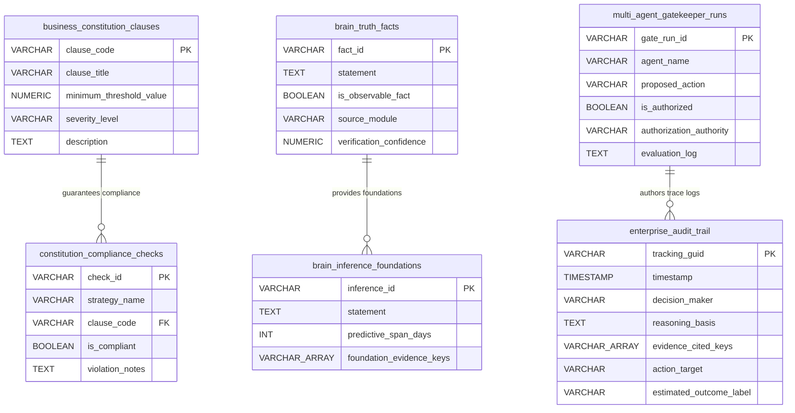

# Trusted Enterprise Intelligence - Entity Relationship Diagram

This file defines the physical and logical relationships holding the system truth engine, constitution rule enforcement, and multi-agent authorization governance.

