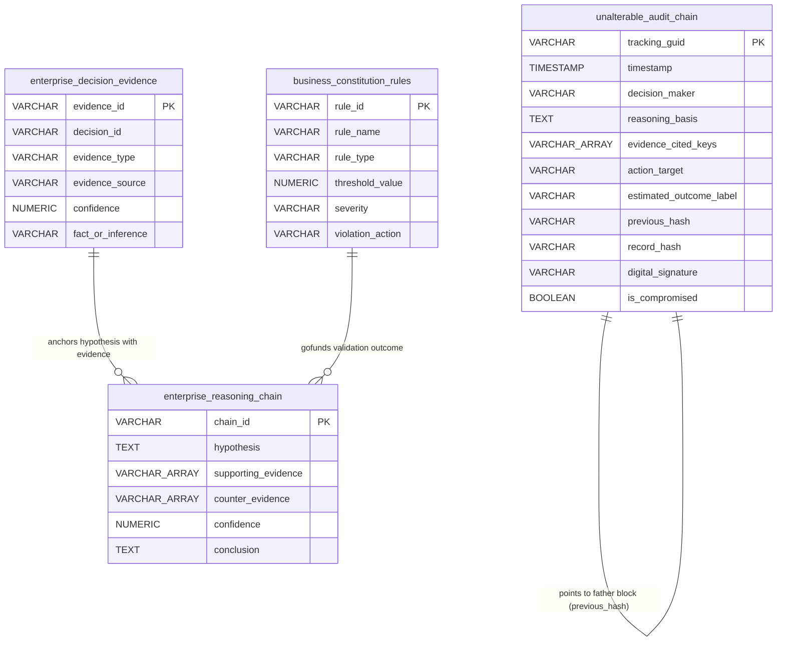

# Enterprise Trust & Governance - Entity Relationship Diagram

This diagram displays the secure components making up the Immutable Governance platform of the AI Commerce OS.

```mermaid
erDiagram
    unalterable_audit_chain ||--|| unalterable_audit_chain : "points to father block (previous_hash)"
    enterprise_decision_evidence ||--o{ enterprise_reasoning_chain : "anchors hypothesis with evidence"
    business_constitution_rules ||--o{ enterprise_reasoning_chain : "gofunds validation outcome"

    enterprise_decision_evidence {
        VARCHAR evidence_id PK
        VARCHAR decision_id
        VARCHAR evidence_type
        VARCHAR evidence_source
        NUMERIC confidence
        VARCHAR fact_or_inference
    }

    enterprise_reasoning_chain {
        VARCHAR chain_id PK
        TEXT hypothesis
        VARCHAR_ARRAY supporting_evidence
        VARCHAR_ARRAY counter_evidence
        NUMERIC confidence
        TEXT conclusion
    }

    business_constitution_rules {
        VARCHAR rule_id PK
        VARCHAR rule_name
        VARCHAR rule_type
        NUMERIC threshold_value
        VARCHAR severity
        VARCHAR violation_action
    }

    unalterable_audit_chain {
        VARCHAR tracking_guid PK
        TIMESTAMP timestamp
        VARCHAR decision_maker
        TEXT reasoning_basis
        VARCHAR_ARRAY evidence_cited_keys
        VARCHAR action_target
        VARCHAR estimated_outcome_label
        VARCHAR previous_hash
        VARCHAR record_hash
        VARCHAR digital_signature
        BOOLEAN is_compromised
    }
```
