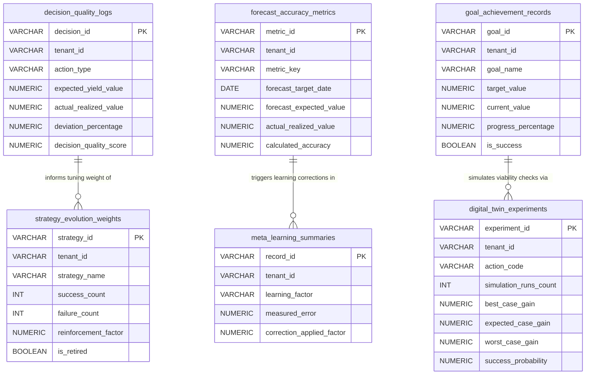

# Enterprise Digital Brain V4 - Entity Relationship Diagram

This diagram displays the relationship schema representing the feedback loop of the Digital Brain V4 cognitive execution engine.

```mermaid
erDiagram
    decision_quality_logs ||--o{ strategy_evolution_weights : "informs tuning weight of"
    forecast_accuracy_metrics ||--o{ meta_learning_summaries : "triggers learning corrections in"
    goal_achievement_records ||--o{ digital_twin_experiments : "simulates viability checks via"

    decision_quality_logs {
        VARCHAR decision_id PK
        VARCHAR tenant_id
        VARCHAR action_type
        NUMERIC expected_yield_value
        NUMERIC actual_realized_value
        NUMERIC deviation_percentage
        NUMERIC decision_quality_score
    }

    forecast_accuracy_metrics {
        VARCHAR metric_id PK
        VARCHAR tenant_id
        VARCHAR metric_key
        DATE forecast_target_date
        NUMERIC forecast_expected_value
        NUMERIC actual_realized_value
        NUMERIC calculated_accuracy
    }

    goal_achievement_records {
        VARCHAR goal_id PK
        VARCHAR tenant_id
        VARCHAR goal_name
        NUMERIC target_value
        NUMERIC current_value
        NUMERIC progress_percentage
        BOOLEAN is_success
    }

    strategy_evolution_weights {
        VARCHAR strategy_id PK
        VARCHAR tenant_id
        VARCHAR strategy_name
        INT success_count
        INT failure_count
        NUMERIC reinforcement_factor
        BOOLEAN is_retired
    }

    digital_twin_experiments {
        VARCHAR experiment_id PK
        VARCHAR tenant_id
        VARCHAR action_code
        INT simulation_runs_count
        NUMERIC best_case_gain
        NUMERIC expected_case_gain
        NUMERIC worst_case_gain
        NUMERIC success_probability
    }

    meta_learning_summaries {
        VARCHAR record_id PK
        VARCHAR tenant_id
        VARCHAR learning_factor
        NUMERIC measured_error
        NUMERIC correction_applied_factor
    }
```
