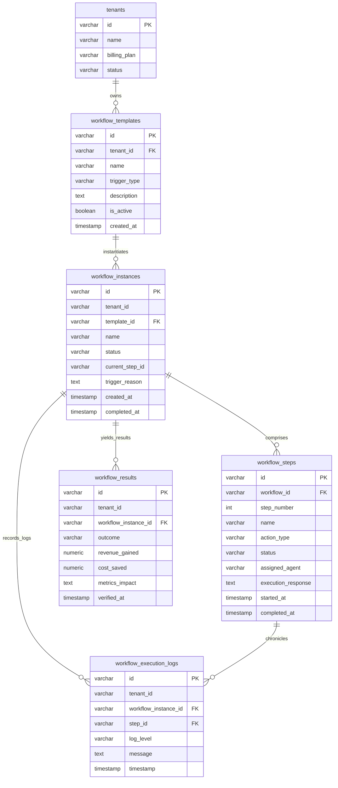

# AI Commerce OS - ERD (Entity Relationship Diagram)

ERD layout referencing the relationships between multi-tenant structural cores and the **Phase 195: Business Workflow Engine** entities.

## Architectural Decoupling Details
- **Multi-Tenant Integrity:** Every lookup in both шаблонах (templates) and instances checks tenancy via the foreign key `tenant_id` linked securely to `tenants(id)`.
- **Bilateral Relation Stability:** Deleting an orchestration template Cascades down to purge all spawned executions, chronological tracker steps, and financial outcomes to prevent orphan data pollution.
- **Set Null Log Protection:** Audit logs (`workflow_execution_logs`) reference individual steps via `ON DELETE SET NULL`, preserving the integrity of executive tracking journals even if low-level step records are cleared during database compression routines.
