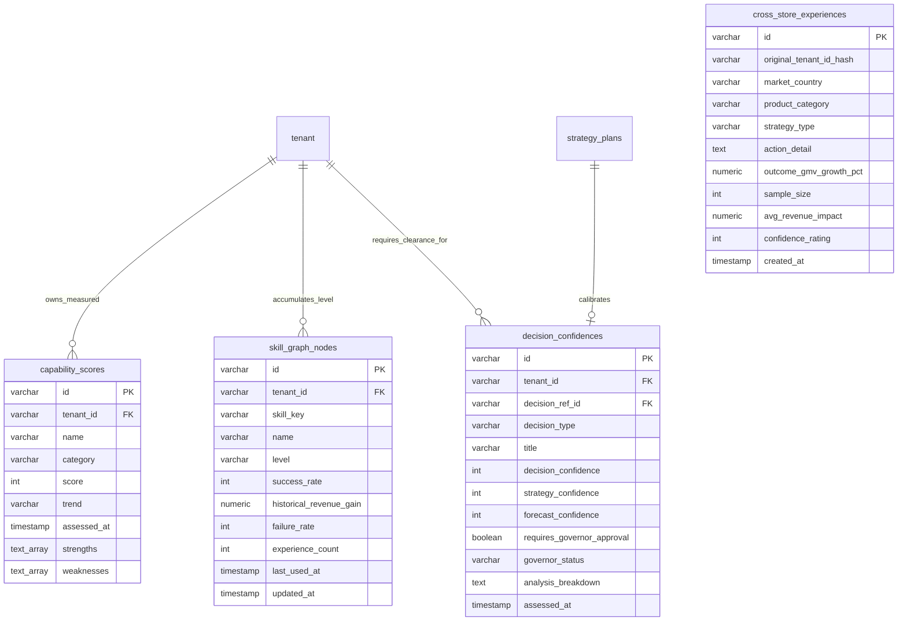

# AI Commerce OS - 实体关系图 (核心脑力与技能共享 Phase 203 - Phase 206)

本文档展现 **Enterprise Brain（总后台超管大脑）** 下 Phase 203 - Phase 206 的模型关联及闭环级联流控逻辑拓扑。

## 认知自愈级联流控设计
1. **策略审计与置信锁合 (Calibration Loop):**
   - 产生任一策略预案 (`strategy_plans`) 时，Confidence Engine 将同步为此生成唯一的安全置信度凭据 (`decision_confidences`)。
   - 分项低于 $70\%$ 的置信值将导致 `requires_governor_approval` 直接拉高为 `TRUE`，阻止多智能体工作流执行引擎 (`GoalExecutionEngine`/`BusinessWorkflowEngine`) 的自主下达与扣减动作，并将其强制重定投送到 **SuperAdminGovernor** 人机协同中枢里，完美抵御黑天鹅和理智失控造成的持久流动性损折。
2. **脱敏经验沉淀设计 (Anonymized sharing):**
   - 匿名多店经验信息 (`cross_store_experiences`) 底层不挂接 `tenant_id` 外键约束。
   - **理由**：为了极致确保多租户数据资产的安全边界（欧洲 GDPR 等条例）。就算有一天源商户对店铺进行了销户、物理清理，已被其在战斗中所自愈验证的商业行动对冲常识（如大衣促销 8% 具有 18% GMV 恢复增幅），已作为公共智慧结晶永久沉淀在了多店公网上。脱离外键依附能够让大脑经验对单店兴亡对消物理依赖，保护全网数千店面的共同商业增长。
