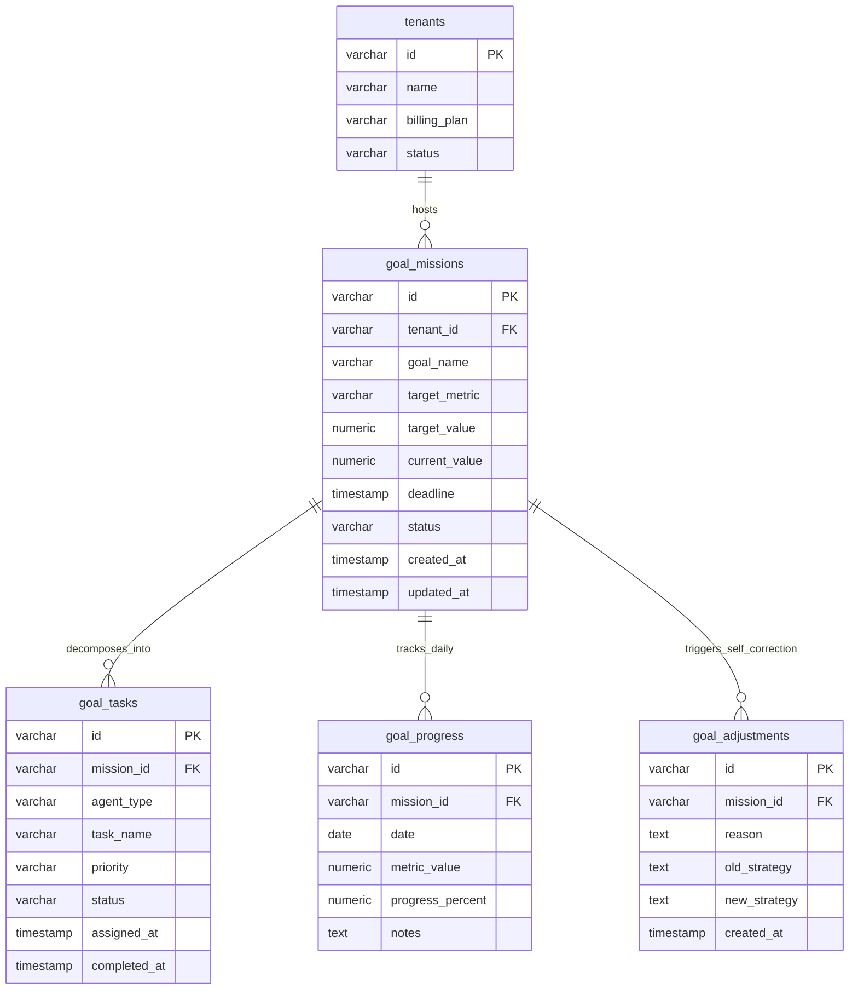

# AI Commerce OS - ERD (Entity Relationship Diagram)

ERD layout referencing the relationships between multi-tenant structural cores and the **Phase 191: Goal Execution Engine v1** entities.

## Architectural Decoupling details
- **Multi-tenant Integrity:** Every lookup in `goal_missions` checks tenancy via the foreign key `tenant_id` linked securely to `tenants(id)`.
- **Relational Integrity:** Restricting Cascade constraints at database-engine and schema levels so that deleting a high-level mission purges associated sub-tasks, telemetry records, and corrections instantly to prevent orphan pollution.
